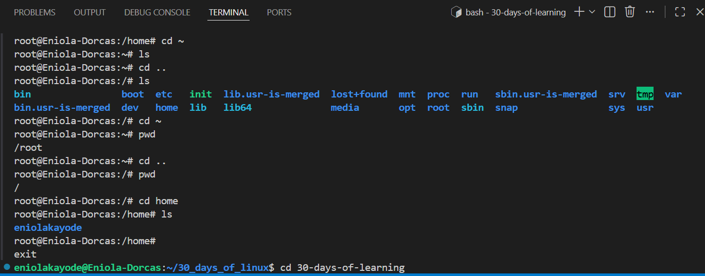
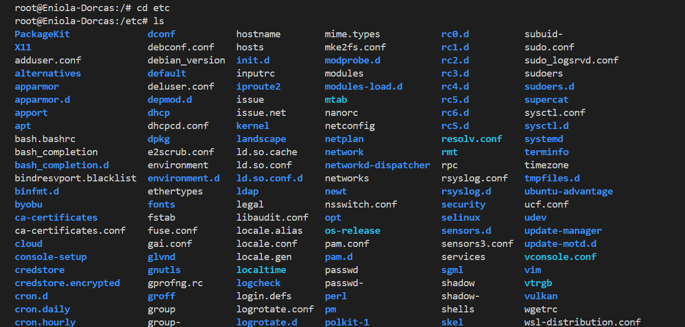

# Day 02 - Linux File System

## Objective

My goal today is to have a solid understanding of Linux file system and Explore the file system

---

## What I Learned

I learnt:

#### What a File System is
A file system is the structure, rules, and methods for how data is organized, stored, accessed, and managed on a storage device. 

Basically a Linux File system is how data is stored on a linux machine. Linux follows the File System Heirarchical standard (FHS) structure. In the FHS, all files and directories appear under the root directory /, even if they are stored on different physical or virtual devices.

Therefore all files and directories in Linux starts from the root directory (/)

#### Linux File System Structure

The Linux directory starts with the root (/), then the root directory has other directories in it. 

- / (Root) - This is the base point, every single file and directory start from here.

Sub directories in the root are :
- /bin - It contains commands that can be used by all users e.g ls
- /etc - This directory contains configuration files
- /home - It contains user home directories. Usually the home directory for all users asides the admin
- /opt - Holds third-party software or packages not part of the default system installation
- /tmp - Temporary files created during program execution are stored here, and deleted after the program finishes or system reboots.
- /var - Stores variable data such as log files that change frequently during system operation.
-/sbin - Just like /bin it contains linux commands, this commands are typically used for system maintainance by system administator
- /usr - Contain essential user-space programs, libraries, headers, and shared data used by both regular users and administrators. some user binaries not found in /bin or /sbin can be found here.
- /proc - This directory has files that have information on running proceses 
- /dev -  Stores device files that represent hardware devices such as disks and partitions.
- /lib - Contains shared libraries and kernel modules required for applications to run
- /media - Contains subdirectories where removable media devices like USB drives and CDs are mounted.
- /boot - This directory stores all files required for booting the system.
- /mnt - In this directory this is where connected drives are temporarily mounted. This is where their contents become accessible to the system.
- /srv - Stores server specific data related to services provided by the system.

These are not the only sub-directories that exist tho, because I noticed more than these on my system

#### File system Navigation commands
These commands are pwd, cd, ls, mkdir, cp, rmdir, rm, du, and mv which I am familiar with asides du which is used for checking directory size.

I got to learn about the command anatomy

Commands [options] [arguments]

Example - `ls -la /home`

- command: ls (list directory contents)
- option: -la (long listing format (detailed) + include hidden files)
- argument: /home (which directory)

#### Absolute Path and Relative Path

- Absolute path - is the total or complete path of a file. it starts from the root / directory step by step to the exact location of the file.
    -  Absolute path remains the same everywhere, so it can be used from any location
    - it is best for automation
    - It gives clarity, you are able to know where you are.

- Relative Path - This is location of a file relative to the current working directory. 
    - It is good for quick navigation
    - Avoid forgetting the current directory while using relative paths

---

## What I Built / Practiced

I praticed navigating the file system/ directories both as a regular user and admin

---

## Challenges Faced

I got confused when I used the `cd ~` command and it wouldn't take me to my home directory. Unkown to me /root is the home directory when for admin users. 

---

## Key Takeaways

- / is the linux root directory and it is different from /root directory
- command prompt of general users  is $ while admin prompt is #
- Absolute paths should be used when running automation jobs while relative path can be used during navigations
- Linux File names are case-sensitive, so File.txt and file.txt are treated as different files.

Bonus!
I learnt this shortcut to preview readme in VScode `Ctrl + Shift + V`

---

## Resources

- https://www.geeksforgeeks.org/linux-unix/linux-tutorial/
- https://www.geeksforgeeks.org/linux-unix/absolute-relative-pathnames-unix/
- https://github.com/Najeeb-Sulaiman/linux-and-bash-scripting-guide/tree/main

---

## Output

---

