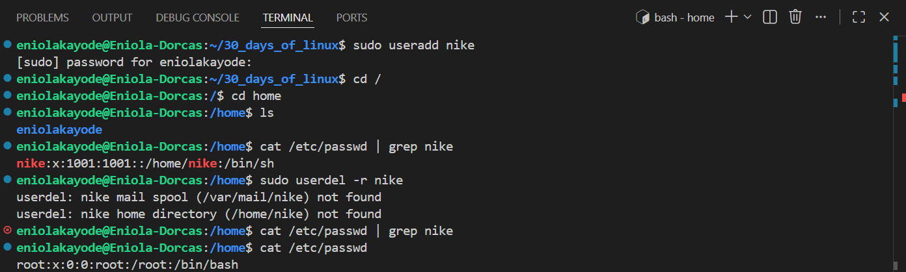
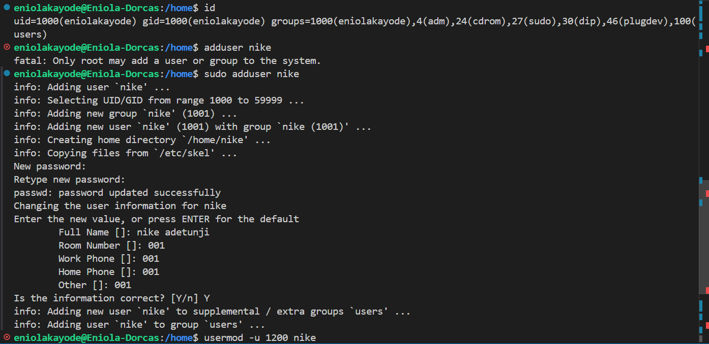

# Day 04 - Linux User Management

## Objective

My goal for today is to understand user management in Linux

---

## What I Learned

I Learnt:

#### What User Management In Linux Is

Linux is a multi-user system, which means that multiple people can access it simultaneously. This is the reason its users must be properly managed so as to avoid unauthorized access to the system or a user interfering with another

User Management is a system administration function of Linux, it controls system access, enforces security, and ensures users have the correct privileges for their tasks.

#### Users Vs Group

- User: This refers to a person or process account.
- Group: A collection of users with shared access rights.

#### Types Of Users in Linux

- Root (Superuser): Root user has full system control, can install software, change config files, and delete anything. 
- Regular User: A regular user can create files, run applications, but not modify system-level settings.
- Sudo User: A regular user with temporary admin rights via the sudo command. 
- System/Service Account - Non-human accounts used by services (e.g., mysql, nginx)
- Guest User - They are temporary users with minimal privileges and their changes are not saved after logout.

#### User Management Files

These are files that are modified when a new user is created.

- User Information
    - /etc/passwd: Stores basic details of all user accounts
    - /etc/shadow: Stores encrypted user passwords and password-related settings
- Group Information
    - /etc/group: Defines all groups in the system and user memberships
    - /etc/gshadow: Stores encrypted groups password
- Privilege Control
    - /etc/sudoers: Manages sudo access for users and groups:
- User Home Directory Setup
    - /etc/skel/: Directory containing default configuration files copied to a new user’s home directory
- Logs and Auditing
    - /var/log/auth.log: Records authentication-related events

#### Sudo Commands

Sudo command is used to run system-level commands that require higher permissions, without logging in directly as the root user.

#### Difference Between sudo and su

- su - The su command is used to switch from one user account to another user account (can be the root ), after switching it gives full priviledge of that user, until that session is exited. This command requires password, and sharing the root password with multiple users is insecure because anyone with the password can perform any action on the system. Can't be audited.
- sudo - The sudo command allows running of commands with administrative privileges without switching to another user account. This makes it easier to perform system tasks safely while remaining in your own user session. All commands run with sudo are logged in system files (usually /var/log/auth.log), allowing administrators to audit who ran what command and when.

#### Commands used for User Management

| Commands| Description | Options |
|-------|-------|-------|
| id | Shows user ID (UID), group ID (GID), and groups |`-g` `-G` `-n` `-r` `-u`|
| useradd| creates a new user | `-d` `-M` `-m` `-u` `-g` `-e` `-c` `s` |
| adduser| creates user interactively| `--home` `--shell` `--conf` |
| passwd | Used to assign a password to the user| `-l` `-u` `-e` `-x` `-n`|
| usermod| change the info of an existing user | `-d` `-M` `-m` `-u` `-g` `-e` `-c` `s`|
| userdel| delete an existing user | `-f` `-r` `-R` `-Z` |

---

## What I Built / Practiced

- I praticed using the user Management commands

---

## Challenges Faced

No challenge faced today

---

## Key Takeaways

- It is best to use `Sudo` instead of `su`
- Always use the sudo command with other file management commands

---

## Resources

- https://www.geeksforgeeks.org/linux-unix/user-management-in-linux/
- https://github.com/Najeeb-Sulaiman/linux-and-bash-scripting-guide/blob/main/03-linux-user-management/01-users-and-groups.md

---

## Output

---

---

