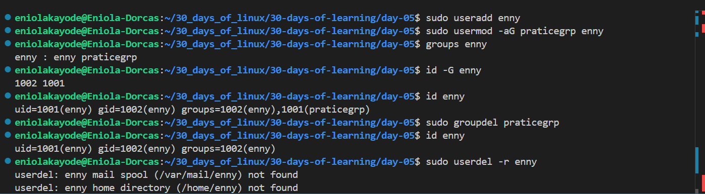
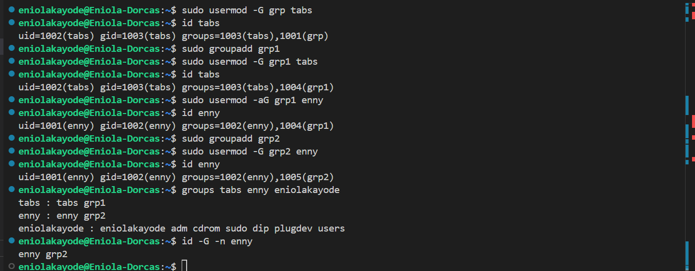
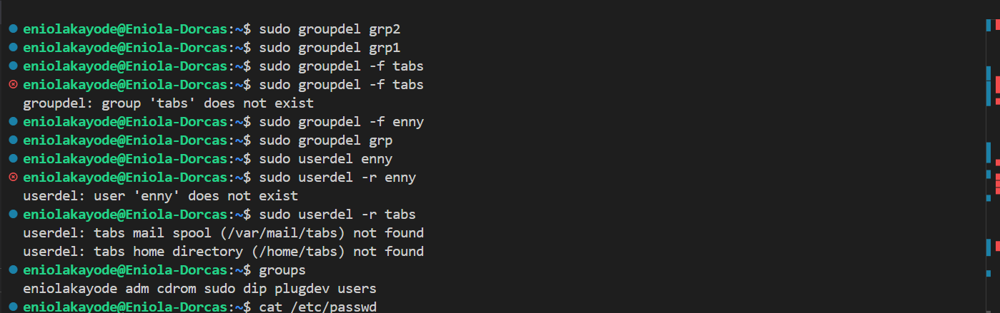

# Day 05 - Linux Group Management

## Objective

My goal today is to know and understand group management in Linux 

---

## What I Learned

I Learnt:

#### MEANING OF GROUP MANAGEMENT IN LINUX

Group management IS just like user management used to organize users and control access to files, directories, and system resources. 

It supports collaborative work environments, each user belongs to at least one group, and permissions are often assigned to groups instead of individual users.

#### Types of Groups

- Primary Group: This is the group a user is assigned to by default upon user creation. 
    - Each user can only have one primary group
    - It has the same Group ID (GID) as the User ID (UID)
    - Primary group cannot be removed while the user account exists
    - All files created by the user belong to this group by default
- Secondary Group: A secondary group is created separately and used to grant additional permissions.
    - A user can belong to multiple secondary groups at the same time
    - Allows shared access to resources

#### Commands for Group Management

| Commands| Description | Options |
|-------|-------|-------|
| groupadd | Used to create new groups |
| gpasswd | Used to manage group passwords and membership| 
| usermod -G | Adds a user to a group and removes the user from other secondary groups| 
| usermod -aG | Adds a user to a group without removing the user from other existing groups| 
| gpasswd -M| Adds multiple user to a group | 
| gpasswd -d| Removes a user from a group | 
| groupdel | Used to permanently remove a group| 
| groups | display the group memberships of a user| 
| newgrp | switch to a new group | 
| getent | command retrieves information from system databases (/etc/group, LDAP, NIS) |

--- 

## What I Built / Practiced

I praticed working user and group management operations

---

## Challenges Faced

- I noticed that when I created a new user in my systenm, it didn't have same Group ID (GID) as the User ID (UID), as seen in the resources I saw online. 

    I noticed it is because I created a different group before creating the user.

---

## Key Takeaways

- Efficient user and group Management is a must for secured access to the system.

---

## Resources

- https://www.geeksforgeeks.org/linux-unix/group-management-in-linux/

---

## Output

---

---

