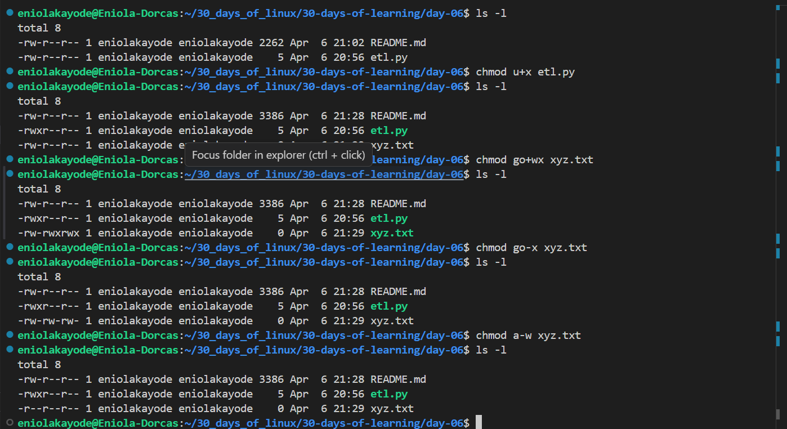
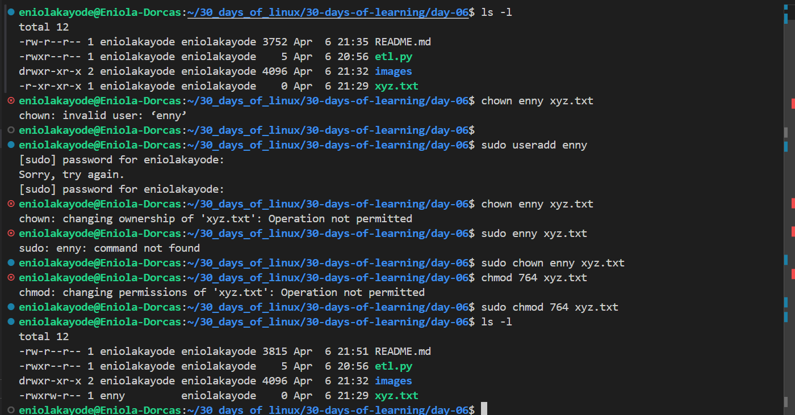

# Day 06 - Linux Fike Permission

## Objective

My goal today is to learn an understand Linux file permission

---

## What I Learned

I learnt:

#### What File Permission means

Every file and directory in Linux has permissions that control:

- Who can access it
- What they can do with it (read, write, execute)

File permision ensures only authorized users or processes can access sensitive data.

#### The Three Basic Permissions

- Read (r): View the file’s contents or list a directory’s files.
- Write (w): Modify a file or create/delete files in a directory.
- Execute (x): Run a file as a program/script or enter a directory.

#### Ownership and Permission groups

Permissions of each file and directory are assigned to three categories of users:

- User (u): The person who owns/created the file.
- Group (g): Users belonging to the file's group.
- Others (o): Everyone else on the system.

#### How to Check the Permission of Files in Linux

This command can be used to view a file or directory permission.

`ls -l`

out put: `-rwxr-xr-- 3 eniolakayode devs 4096 Apr  5 13:36 xyz.txt`

what the output means:

| Part | Meaning| 
| ------| -------|
| -	Type | (- = file, d = directory, l = link) |
| rwx | Owner permissions (read, write, execute)|
| r-x | Group permissions (read,execute)|
| r-- |	Others permissions (read only)|
| eniolakayode | Owner|
| devs | Group|
| 4096 | File size|
| xyz.txt | File name|

This means:
- The owner can read/write/execute
- The group can read/execute
- Others can only read/execute

#### File Permissions Modification Operators

Symbols are used to specify what type of permissions to be mad

- `+` - To add a permission
- `-` - To remove a permission
- `=` - To set permission

#### How to Change Permissions in Linux

The `chmod` command is used to change permissions in Linux, this command represents `change mode`. This is because the nine security characters are collectively called the security "mode" of the file.

There are two ways to modify permissions:

- symbolic Notation - This method allows adding, removing or setting of permissions using letters.
    - `chmod o+x xyz.txt`  - adds execute permission to others for file xyz.txt
    - `chmod g-w xyz.txt`  - removes write permission to group for file xyz.txt
    - `chmod a+x xyz.txt` - gives everyone execute permission for file xyz.txt
    - `chmod ug+rw,o-x xyz.txt` - gives read and write permission to users and group, then removes execute permission for others
- Octal (numeric) Notation - This method allows adding, removing or setting of permissions using numbers. Each permission has a number value;

    | Permission | Value |
    | --------- | ------- |
    | r	 | 4 |
    | w | 2 |
    | x | 1 |

    They are summed up to get owners, groups and others permission
    | Permission | Value |
    | --------- | ------- |
    | rwx | 7 |
    | rw- | 6 |
    | r-x | 5 |
    | r-- | 4 |
    | --- | 0 |

    Example:

    `chmod 754 etl.py` 

    This Means: 
    - Owner can read, write,  and execute
    - Group can read and execute
    - Others can only read
    
#### How to Change File Ownership

The `chown` command is used to change file ownership,

Example:

`sudo chown enny xyz.txt` - Change ownership of file xyz.txt

`sudo chown enny:devs etl.py` - change both owner and group for file xyz.txt 

---

## What I Built / Practiced

I changed differrent files permission, changed their ownership also just to pratice file permission commands

---

## Challenges Faced

- No challenges, it was a fun and engaging learning experience

---

## Key Takeaways

- Only the root user can perform changing of permissions or ownership of the files that are not owned by them.

---

## Resources

- https://www.geeksforgeeks.org/linux-unix/set-file-permissions-linux/
- https://github.com/Najeeb-Sulaiman/linux-and-bash-scripting-guide/blob/main/04-linux-file-permissions-and-ownership/01-file-permissions-and-ownership.md

---

## Output

---

