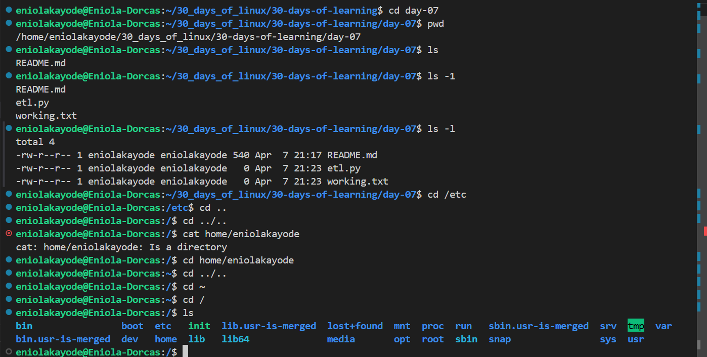
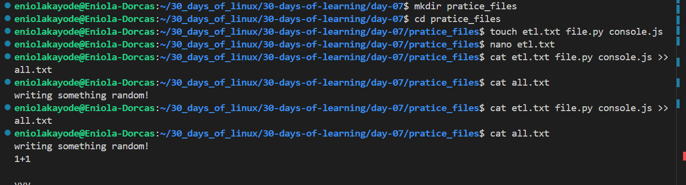
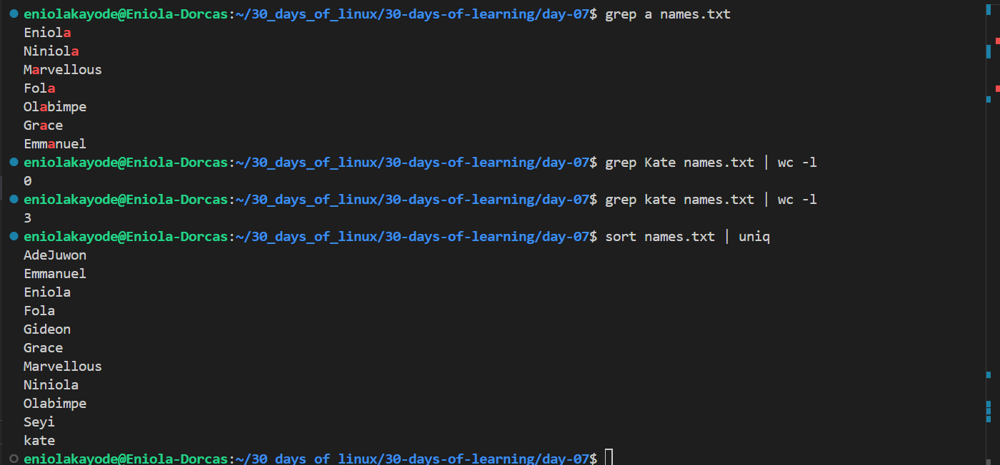

# Day 07 - Pratice

## Objective

The goal Today is to pratice all I have learnt the past few days. Just do exercises and refresh.

---

## What I Learned

- Linux Fundamentals
- Linux Commands
- Linux User and Group Management

---

## What I Built / Practiced

- I praticed the concepts and commands I have learnt the past days. Did exercises also.
- I edited a file in a nano text editor which was a challenge earlier

---

## Challenges Faced

- Forgetting some commands syntax

---

## Key Takeaways

- Pratice makes perfect
- The grep command is case sensitive by default

---

## Resources

- https://github.com/Najeeb-Sulaiman/linux-and-bash-scripting-guide/blob/main/02-linux-commands/10-exercise.md

---

## Output

---

---

---
