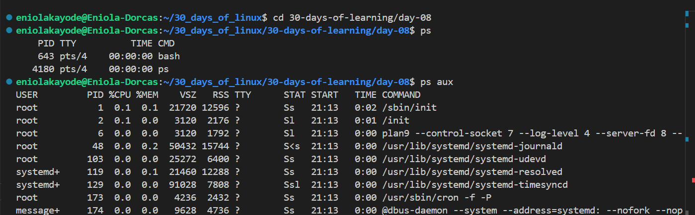

# Day 08 - Linux Processes

## Objective

My goal today is to learn and understand Linux processes

---

## What I Learned

I Learnt:

#### Meaning Of Linux Process

Process is known as a running instance of a program. It is when a program ( a file, command, application) is executing. When a command is ran, Linux starts a process to execute the command, displays the output, and then ends the process.

Each process has it's own Process ID (PID). PID is the unique ID assigned to each running process.

#### Methods of Processes

- Foreground Process - This process runs in the terminal, it takes an input, blocks the terminal till it finishes and sends an output to the screen.
- Background Process - This process runs independently of the terminal, it allows performing other tasks simultaneously. It doesnt take input from the keyboard
- Parent Process - This is a process that creates other processes. When a parent process is terminated, a child process is terminated also
- Child Process - The process which is created by another process

#### Tracking running Processes

- `ps`

    This command is used to display information about currently running processes. It shows static process information rather than continuously updating output. When executed without options, the ps command only shows processes associated with the current terminal.
- `ps aux` 

    The ps aux format displays a detailed view of all running processes including user processes, system services, and background tasks. It provides information such as CPU usage, memory usage, process owner, start time, command name.
- `top`
    
    This command  starts an interactive monitoring interface that displays a real time list of running processes with overall system resource usage such as CPU load, memory consumption, and system uptime. press q to exit the interface.
- `htop`
    It is an improved version of the top command, offering a more user-friendly interface with better visualization and control.
- `kill`
    The kill command is used to terminate processes, but it can also pause, resume, or perform other actions depending on the signal sent. The kill command is used when we know the process ID (PID) of a running process. By default, it sends the SIGTERM (15) signal to terminate a 
    process.
    - `kill <pid>` - Gracefully terminate
    - `kill  -9 <pid>` - Force kill a ptocess
    - `kill -STOP <PID>` - Pause a Running Process
    - `kill -CONT <PID>` - Resume a paused Process

---

## What I Built / Practiced

- Ran some of the process tracking commands.

---

## Challenges Faced

- really tired today and can't do much pratical.

---

## Key Takeaways

- A process occurs when a program is executed/running

---

## Resources

- https://github.com/Najeeb-Sulaiman/linux-and-bash-scripting-guide/blob/main/05-linux-processes/01-understanding-processes.md
- https://medium.com/@nakuldesai123/understanding-the-linux-processes-basic-e6900de2454b

---

## Output

