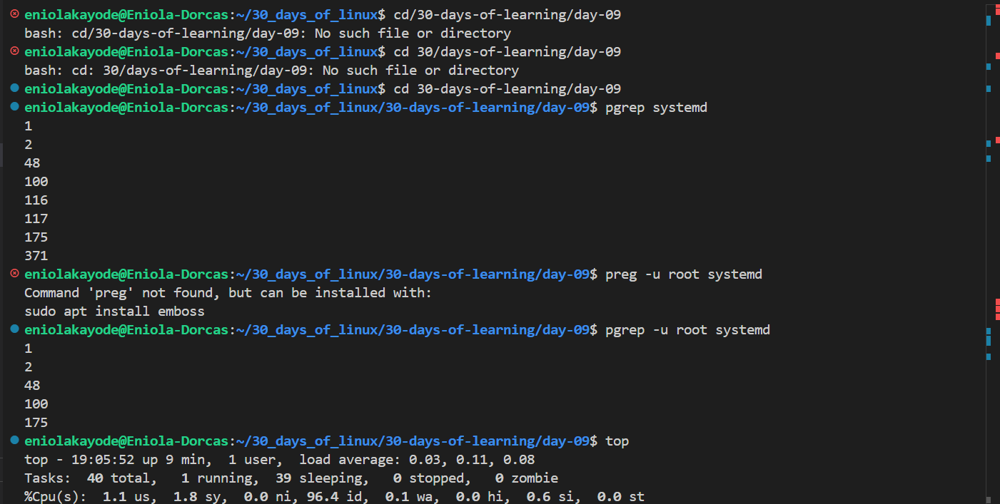

# Day 09 - Linux Processes

## Objective

My goal today is to better understand linux processes

---

## What I Learned

#### Process Management Commands and Their options

- `ps`
- `top`
- `htop`
- `kill`

#### Nice and Renice Command 

Priority dictate the order in which processes are executed by the CPU. There are two commands used to manage process priorities to control how much CPU time each process receives. They help to optimize system performance when multiple processes compete for resources.

These commands are: nice and renice

- nice: It is used to set the priority of a process
    - `nice -10 <command>` - To set the positive priority of a process
    - `nice --10 <command>` - To set the negative priority of a process
- renice: It is used to change the  priority of a running process

N.B:

    - Nice values range from -20 to +19
    - A lower nice value means higher scheduling priority
    - A higher nice value means lower scheduling priority

---

## What I Built / Practiced

- I praticed process Management operations

---

## Challenges Faced

- I had issue using the nice and renice commands

---

## Key Takeaways

- Processes in Linux are prioritized for CPU resource management

---

## Resources

- https://www.geeksforgeeks.org/linux-unix/nice-and-renice-command-in-linux-with-examples/

---

## Output

