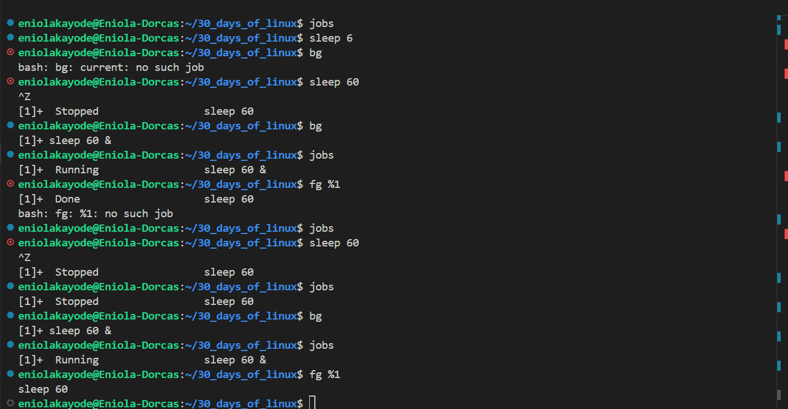

# Day 10 - Linux Jobs

## Objective

My goal today is to learn about Linux Jobs and it's commands

---

## What I Learned

I Learnt:

#### Jobs Meaning
Jobs is a process or set of processes. It is a task started in the shell. 
    
`sleep 60` :  A job with one process (sleep)

`ls | grep txt` :  A job with two processes (ls) and (grep)

#### Jobs commands
- `jobs` - prins all currently running backgraound jobs
- `bg` : It is used to resume a suspended job and run it in the background. The `&` symbol is also used as bg commands 
- `fg` : It is used to bring a background job to the foreground

These commands are often wriiten as `bg/fg [job_spec]`. This job spec is used to identify/refer the job you want  ot move to background or foreground.

Job specs can be specified in the following formats:
- %n: Refers to job number n.
- %str: Refers to a job that was started by a command beginning with str.
- %?str: Refers to a job that was started by a command containing str.
- %% or %+: Refers to the current job. This is the default job operated on if no job_spec is provided.
- %-: Refers to the previous job.

---

## What I Built / Practiced

- I praticed the jobs commands 

---

## Challenges Faced

- None

---

## Key Takeaways

- jobs command are good for process management

---

## Resources

- https://www.geeksforgeeks.org/linux-unix/bg-command-in-linux-with-examples/

---

## Output

