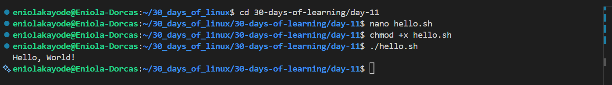

# Day 11 - Introduction to Bash Scripting

## Objective

My goal today is to learn what bash scripting is

---

## What I Learned

I Learnt:

#### What is Bash Scripting

Bash scripting is writing a series of Linux command in a file and executing it together. 

A Bash script is simply a text file containing commands that the shell can execute. Creating and running a script allows automation tasks instead of typing commands manually.

#### Why Use Bash Scripts as a Data Engineer?

|Task | Description |
| ------- | -------- |
| Data Ingestion | Automate the download and organization of raw datasets daily.|
| Data Cleaning	Run | commands (like awk, sed, grep) on multiple files.|
| ETL Orchestration | Chain multiple scripts together to extract, transform, and load data.|
| Environment Setup | Install dependencies and prepare your local or cloud environment.|
| Monitoring Jobs | Automate health checks and send alerts on failures.|

#### Structure of a Bash Script

Every Bash script has these two parts:
- Shebang line (defines the interpreter)
- Commands or logic (what you want to run)

``` 
#!/bin/bash
# This is a simple bash script
echo "Welcome to Bash scripting!"
echo "Today is $(date)"
```
What does that mean?

- #!/bin/bash: tells the system to use the Bash interpreter.
- Lines starting with #: are comments.
- echo: prints text to the terminal.
- $(date): runs the date command and substitutes its output.

#### How to create a Bash Script
These are the steps to create a bash 

- Step 1: Create a new file
    ```bash
    bash nano welcome.sh
    ```
- step 2: Add the following content and save the file

    ```bash
    #!/bin/bash
    echo "Hello Data Engineers!"
    ```
     to save; `CTRL + O` - save the file, `press Enter` - confirm filename, `CTRL + X` - exit nano
- step 3: Make it executable

    Before running, give it permission: When a new script file is created, it is treated as a regular text file and does not have execution rights by default. Files must have execute permission to run as programs.
    ```bash
    chmod +x welcome.sh
    ```
- step 4: Run your script
    ```bash
    ./welcome.sh
    ```

You should see output like:

```
Hello Data Engineers!
```

---

## What I Built / Practiced

- I praticed creating a script

---

## Challenges Faced

- None

---

## Key Takeaways

- Bash scripting for automation.

---

## Resources

- https://www.geeksforgeeks.org/linux-unix/bash-scripting-introduction-to-bash-and-bash-scripting/

---

## Output


