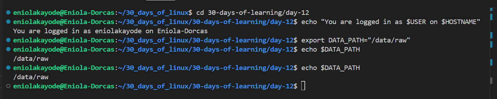

# Day 12 - Variables in Bash Scripting

## Objective

My goal today is to continue learning Bash scripting, specifically focus on variables.

---

## What I Learned

I Learnt:

#### What a Variable is this
A variable is a name for a value that you can store and reference later, The value can be text, numbers, command output, or even arrays. They act as placeholders for data that can be accessed and modified during script execution. 

#### How Variables are handled by the shell
- Reads the script line by line, it interprets each line sequentially.
- It detects any variable names and their assigned values.
- The variable names are replaced with their assigned values wherever they are used.
- Commands run using the substituted values
- Bash continues this process until the end of the script.

#### Naming rules for Variables
To avoid errors and ensure clarity in scripts, variable names;
- Should start with a letter or underscore (_)
- Can include only letters, numbers, and underscores but no other special characters
- Are Case-sensitive(gfg, Gfg, and GFG are considered different variables)

Using lowercase letters for user-defined variables is recommended to avoid conflicts with system-defined variables.

#### Defining Variable
```
#!/bin/bash
name=Eniola
role="Data Engineer"

echo "Hello, $name! Your role is $role."
```
The name and role are the variables, their value is referenced using $ in the sentence.
    - Don't put spaces around the = sign.
    - If the value contains spaces, the value should be put in quotes.

#### Local and Global Variable
- Local Variable: A local variable is declared inside a function using the local keyword. It exists only during the execution of that function. 
- Global Variable: A global variable is not defined in a function. It can be accessed both inside and outside the function.

#### Command Substitution
Command substitution lets you store the output of a command inside a variable.

For example:
```
#!/bin/bash
current_date=$(date)
echo "The current date and time is: $current_date"
```

#### Reading User Input
Your scripts can interact with users using the read command.

Example:
```
#!/bin/bash
echo "Enter your project name:"
read project
echo "Creating project folder: $project"
mkdir -p "/projects/$project"
```
This is what you get when you run it (assuming your input is etl_pipeline):
```
Enter your project name:
etl_pipeline
Creating project folder: etl_pipeline
```

#### Environment Variables
Bash comes with built-in variables provided by the system. These variables are predefined and maintained by the Bash shell. They are automatically loaded whenever a new shell session starts and are generally written in uppercase letters. They store important system-related information such as user details, paths, and shell configuration.

|Variable |	Description	| Example Output |
|--------|------------|------------|
| $USER	| Current username	| eniola |
| $HOME	|Home directory | /home/eniola |
| $PWD	|Current directory	| /data/projects |
| $HOSTNAME	|System hostname | data-lab-vm |
| $SHELL	| Current shell	| /bin/bash |

use `printenv` or `env` to view environment variables

Environment variables are useful for building platform-independent scripts that work across systems.

Example:
```
echo "You are logged in as $USER on $HOSTNAME"
```

#### Exporting Variables
export is used when a variable is needed for subsequent programs or script.

For example:
```
export DATA_PATH="/data/raw"
````
Any program or script executed after this can access $DATA_PATH.

#### Constants and Read-only Variables
readonly is used when a variable is needed not to change during execution
```
readonly LOG_DIR="/var/logs/data"
LOG_DIR="/tmp/logs"   # This will cause an error
```
---

## What I Built / Practiced

- Praticed working with variables
---

## Challenges Faced

- None

---

## Key Takeaways

- Variables make scripts dynamic, reusable, and easier to manage.

---

## Resources

- https://github.com/Najeeb-Sulaiman/linux-and-bash-scripting-guide/blob/main/07-bash-scripting/02-variables-and-user-input.md
- https://www.geeksforgeeks.org/linux-unix/bash-script-define-bash-variables-and-its-types/

---

## Output


