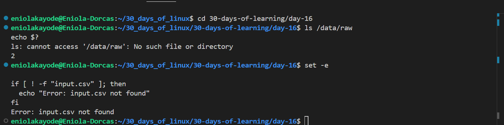
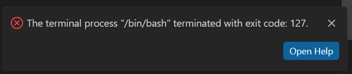

# Day 16 - Error Handling and Debugging

## Objective

My goal for today is to learn how error is been handled in bash script.
---

## What I Learned

#### What is the benefit of Error Handling?
Without proper error handling, a Bash script can:
- Continue running after a failure (causing data corruption)
- Overwrite important files
- Fail silently without knowing what happened

#### Exit Codes in Bashed
Every command executed in bash returns an exit status code. There are two types of exit status code

- 0 : Success
- Non-zero digit: Failure

The exit status code of the last executed command can be accessed with `$?`

Example
```
ls /data/raw
echo $?
```

- If /data/raw exists - 0
- If it doesn't - non-zero value (e.g., 2).

some exit codes and their meaning:

| Code |	Meaning |
|--------|-------|
| 0 | Success |
| 1	| General error |
| 2	| Misuse of shell builtins |
| 126 | Command invoked cannot execute |
| 127 | Command not found |
| 130 | Script terminated by Ctrl+C |


#### How to stop a script on error
The command `set -e` tells Bash to immediately exit if any command fails.

```
#!/bin/bash
set -e

echo "Starting pipeline..."
cp /data/raw/input.csv /data/tmp/
awk -F, '$6 != "Failed"' /data/tmp/input.csv > /data/tmp/clean.csv
mv /data/tmp/clean.csv /data/processed/
echo "Pipeline completed successfully!"
```
if any command fails in this script, the script stops right there, preventing partial or corrupted processing.

#### How to enable debug mode
The command `Set -x` is used to enable debug mode. Debug mode is used to trace what is happenning when a script does not run as expected.

Example 
```
#!/bin/bash
set -x  # Enable debug mode

echo "Starting job..."
cp /data/raw/input.csv /data/tmp/
awk -F, '$6 != "Failed"' /data/tmp/input.csv > /data/tmp/clean.csv
set +x  # Disable debug mode
```

When debug mode is enabled, the output shows both the commands and the command results

Output
```
+ echo 'Starting job...'
Starting job...
+ cp /data/raw/input.csv /data/tmp/
+ awk -F, '$6 != "Failed"' /data/tmp/input.csv > /data/tmp/clean.csv
```

#### How to catch undefined Variables
The command `set -u` (or set -o nounset) makes Bash throw an error when an undefined variable is used.

Example
```
#!/bin/bash
set -u

echo "Username: $USER_NAME"
```

If $USER_NAME is not defined, Bash exits with:

```
./script.sh: line 3: USER_NAME: unbound variable
```

#### Combinig Safety Options

multiple safety flags can be combined for more robust scripts.

```
#!/bin/bash
set -euo pipefail
# -e  - exit on error
# -u  - undefined variables cause error
# -o pipefail - fail if any command in a pipeline fails
```


---

## What I Built / Practiced

- I praticed some error handling processes

---

## Challenges Faced

- None

---

## Key Takeaways

- Error handling and debugging are important in production

---

## Resources

- https://github.com/Najeeb-Sulaiman/linux-and-bash-scripting-guide/blob/main/07-bash-scripting/06-error-handling-and-debugging.md

---

## Output


---

