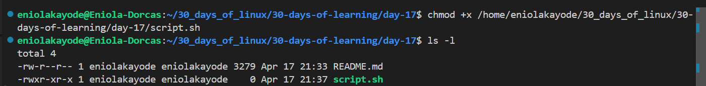
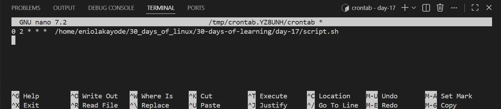
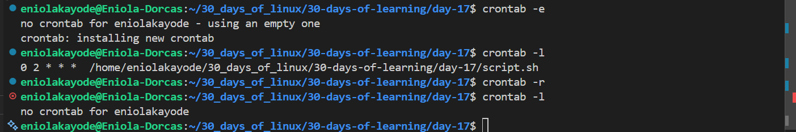

# Day 17 - Scheduling with cron in Bash scripts

## Objective

My goal today is to learn how Scheduling/automation works in linux

---

## What I Learned

#### Why scheduling is important in data Engineering
There are some tasks that are almost impossible to do manually, and scheduling is the way to go. Examples of such tasks are:

| Task |Frequency | Example|
|--------|---------|---------|
| ETL pipeline execution|	Daily at midnight|	Load fresh data into warehouse|
| Log rotation	| Hourly |	Archive or compress logs|
| Data sync with APIs	| Every 30 minutes |	Fetch new data from API|
| Backups|	Weekly|	Save snapshots of databases|

#### What is cron?
Cron is a time-based job scheduler in Linux systems. The cron daemon (crond) runs in the background and checks scheduled jobs.

Each cron job is defined in a crontab file (cron table) with this format:

```
* * * * * /path/to/command
| | | | |
| | | | └── Day of week (0–6, 0=Sunday)
| | | └──── Month (1–12)
| | └────── Day of month (1–31)
| └──────── Hour (0–23)
└────────── Minute (0–59)
```

For example:

| Schedule | Description |
|----------|-------------|
| 0 0 * * *	|Every day at midnight|
| 30 2 * * 1 | Every Monday at 2:30 AM|
| */15 * * * * | Every 15 minutes |
| 0 */6 * * * |	Every 6 hours |
| 0 9-17 * * 1-5 |	Every hour between 9 AM–5 PM, Monday–Friday |

#### Commands To Manage Cron Jobs

| Command | Description|
|-------|------------|
| crontab -l| View Your Crontab |
| crontab -e | Edit Your Crontab. It opens the user's crontab in the default text editor. |
| crontab -r | Remove All Cron Jobs |

#### How to Schedule using cron

step 1: Make it executable (Always remeber this):

```
chmod +x /home/najeeb/scripts/daily_etl.sh
```
 step 2: Schedule it

```
crontab -e
```
This opens the text editor

step 3: Add
```
0 2 * * * /home/eniola/scripts/daily_etl.sh
```
This runs the ETL job daily at 2 AM.

#### Redirecting Logs for Cron Jobs

Cron jobs run silently by default, they don’t show output on the screen.

These logs should always be redirected to a file.

Example:
```
0 3 * * * /home/najeeb/scripts/backup.sh >> /home/najeeb/logs/backup.log 2>&1
```

- `>>`  - append logs
- `2>&1` - redirect errors to same file as output

#### Testing Cron Jobs Before Scheduling
It is important to test your script manually first before scheduling with cron.

Run your script manually:
```
bash /home/najeeb/scripts/daily_etl.sh
```

Then simulate cron behavior:
```
bash -l -c "/home/najeeb/scripts/daily_etl.sh"
```
This will help to catch environment or permission issues early.

#### Tips when scheduling with cron

| Tip |	Description |
| ------ | --------- |
| Use logs |	Always redirect cron output to log files |
| Test first |	Run manually before scheduling |
| Absolute paths |	Use full paths for commands and files |
| Avoid overlaps |	Ensure jobs don’t run simultaneously (use lock files) |
| Monitor success/failure |	Log exit codes or send notifications |
| Rotate logs |	Clean up old logs automatically |

---

## What I Built / Practiced

- I praticed scheduling a cron job

---

## Challenges Faced

- None

---

## Key Takeaways

- Always make a script executable bbefore scheduling with cron
- Always redirect logs to a file for cron jobs
- Always test cron jobs before scheduling
- https://crontab.guru/ website helps to write cron expression interactively

---

## Resources

- https://github.com/Najeeb-Sulaiman/linux-and-bash-scripting-guide/blob/main/07-bash-scripting/07-scheduling-with-cron.md

---

## Output


---

---

