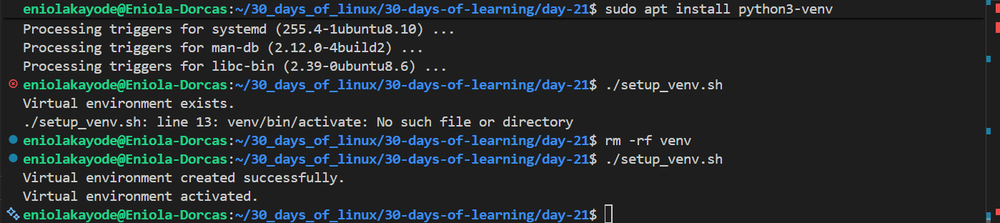

# Day 21 - Create Virtual environment Bash Script Task

## Objective

My goal today is to create a bash script that checks for an existing Python virtual environment, 
if one exists it is activated and if not, create and activate a new one

---

## What I Learned

- I learnt a real world use-case of Bash scripting 

---

## What I Built / Practiced

- I created a bash script that creates and activates a virtual environment

---

## Challenges Faced

- I assumed that the python command is available on the system, but instead it is python3
- When I executed the bash script, I ran into error because the venv module wasn't installed, which caused the virtual environment not to be created successfully (the directory was created but not all of the files)

---

## Key Takeaways

- 
Conditional statements are resourceful

---

## Resources

- https://github.com/Najeeb-Sulaiman/linux-and-bash-scripting-guide/blob/main/08-tasks/task.md

---

## Output

[The Bash Script](setup_venv.sh)
---
