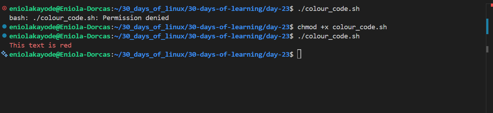

# Day 23 - Bash Script Task continuation

## Objective

My goal today is to continue working on a Python Project Environment Bootstrapper Bash task. I want to work on the task for the script to provide colourful, user-feedback.

---

## What I Learned

#### Changing Colour Code for User-Freindly Feedback

It is good pratice to change the color of text output when working in Linux terminal to enhance readability or to emphasize important information. Doing this is helpful in scripts or when displaying messages to users.

#### How to Change colours using ANSI Escape codes

ANSI EXCAPE CODES - are codes used to define colours in bash, they let you print colored text in the terminal. They work by sending special formatting instructions before your text.

- Step 1 - Define a variable for the colour code

    ```
    RED='\033[0;31m'
    NC='\033[0m'
    ```

    It is important to also define NC, because it resets the terminal back to normal after printing the colored text.
- Step 2 = Use the `echo -e` command to print the colour.

    The -e flag tells echo to interpret escape sequences

    ```
    echo -e "${RED}This text is red${NC}"
    ```

    what it does: 
    - `${RED}` - activates the red colour
    - `This text is red` - is the message to be coloured
    - `${NC}` - resets the colour afterward

#### Combine colours with message type
A script can be made more readable by assigning colours to message types.

| Colour | ANSI Codes| Message Type|
| ----- |----- | ----- |
| Red | '\033[0;31m'| Error |
| Green | ’\033[0;32m’ | Success |
| Yellow | ’\033[0;33m’ | Warning |
| BLUE | '\033[0;34m' | Info |
| Neutral | '\033[0m' | |

    `echo -e "${GREEN}[SUCCESS] Completed successfully.${NC}"`

---

## What I Built / Practiced

- I praticed creating a user-friendly feedback 

---

## Challenges Faced

- None

---

## Key Takeaways

- color codes are helpful in writing scripts

---

## Resources

- https://medium.com/@python-javascript-php-html-css/changing-text-color-in-bash-using-echo-command-adf32a6bc3b8
- https://github.com/Najeeb-Sulaiman/linux-and-bash-scripting-guide/blob/main/08-tasks/task.md

---

## Output


